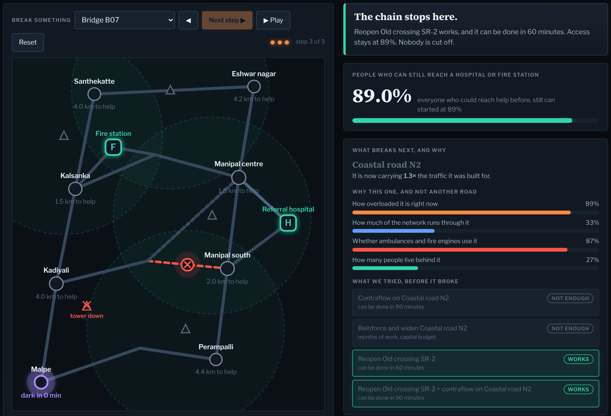
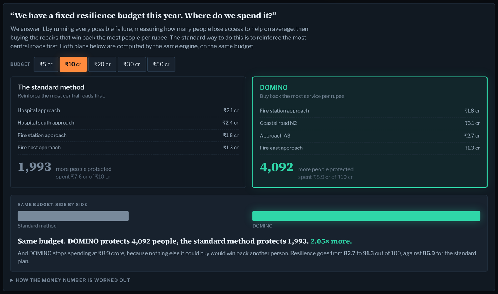

# DOMINO

**Explainable Infrastructure Cascade & Intervention Engine**

*Find the next domino. Stop the cascade. Protect the dark zones.*

Manipal Hackathon 2026 (M#26) · Problem Statement **P05 — Cascading Failure: When One
Failure Becomes Many** · Team **mossad.exe**

---

## The idea in one paragraph

When a bridge fails, everyone can picture the bridge. Almost nobody can picture what
happens three steps later — the road that absorbs the rerouted traffic and gridlocks, the
ambulance route that gets longer, the neighbourhood that ends up with no road to a
hospital *and* no phone signal. Predicting that chain gives you a report. DOMINO answers
the question that actually matters: **where in the chain can you still intervene, and what
does it cost?**

## Two results

**One.** Same corridor, same engine, two bridges:

| seed failure | can it be stopped? | final access | what to do |
|---|---|---|---|
| Bridge B07 | **yes, at step 1** | 89.0% held | reopen the old crossing — 60 minutes |
| Bridge B12 | **no** | 51.3% | nothing holds it: reinforce it before it ever fails |

One is a ninety-minute control-room decision. The other is a capital decision that has to
be taken years earlier. That difference is the **containment horizon**, and it is
computed, not asserted.

**Two.** Given a fixed budget, where should it go? We score our allocation head to head
against the conventional method — rank assets by network centrality and reinforce the most
central first. Same engine, same budget, same hardening action, same cost model.

| at ₹10 crore | spent | people protected |
|---|---|---|
| conventional, most central first | ₹7.6 cr | 1,993 |
| **DOMINO** | **₹8.9 cr** | **4,092** |

Twice the people. And DOMINO stops buying at ₹8.9 crore, because nothing else it could
purchase wins back another person. Corridor resilience goes **82.7 → 91.3** out of 100.

> One honest observation from the sweep: hardening a *central* asset sometimes made the
> expected loss **worse**, because extra capacity redirects the cascade onto a different
> path. Same family of effect as Braess's paradox in traffic networks — and a good
> argument against ranking by centrality alone.

---

## Try it

Open **`docs/index.html`** in any browser. No server, no install, no internet needed.
Three tabs:

1. **Watch a failure spread** — break any road by clicking it, then step through what happens
2. **Where to spend the money** — the budget head-to-head at five budget levels
3. **Every asset at a glance** — all 17 failures, precomputed





## Run the engine

Pure Python standard library. Nothing to install.

```bash
cd engine
python3 run_demo.py B07 T1     # one scenario, printed trace
python3 precompute.py          # all 17 seed failures  -> demo_data.json
python3 planner.py 10          # where to spend ₹10 crore, vs the standard method
python3 plans.py               # five budget levels     -> plans.json
python3 build_dashboard.py     # rebuild ../docs/index.html
```

## How the engine works

1. **Graph.** Roads and bridges are capacitated edges; hospitals, fire stations and phone
   towers are nodes; population sits on ward nodes.
2. **Capacity calibration.** Every road is sized from the demand it actually carries when
   nothing has failed, so the intact corridor runs at 55% of capacity. A load ratio above
   1.0 during a cascade therefore means roughly a doubling of baseline demand.
3. **Baseline access.** Dijkstra from every critical service; a ward is covered if a
   service is within 5 km. Baseline here is **89.0%**.
4. **Assignment.** All-or-nothing over two trip purposes, because a fire station is not a
   substitute for a hospital: medical trips (70%) must reach a hospital, rescue trips
   (30%) the nearest fire station.
5. **Failure injection.** Remove an edge, knock out a tower, reassign everything.
6. **Next domino.** The overloaded edge with the highest score.
7. **Explainable score.** Four components, computed from the graph, weighted:
   load stress `0.35`, network dependency `0.25`, emergency impact `0.25`,
   population exposure `0.15`. It always decomposes.
8. **Counterfactual test.** Apply each candidate action, re-run the whole assignment, and
   check whether anything is still overloaded and whether access held. *Respond* actions
   (contraflow, reopen a closed crossing) take minutes; *harden* actions (reinforce,
   widen) take months.
9. **Loop.** Held → the chain terminates. Not held → that road gridlocks and the loop runs
   again on the next domino.
10. **Containment horizon.** The last step at which an available action still held the
    chain. Horizon 0 means only pre-failure hardening can help.
11. **Dark zones.** Physical isolation **AND** communication isolation, never either
    alone. Because both must hold, `T_dark = max(T_phys, T_comm)` — and the gap between
    the two is the window to pre-position in.
12. **Playbook.** Every plausible seed failure is run offline and emitted as a response
    card, because nobody starts a simulation during a disaster.

## Honest scope

The **corridor is synthetic** — shaped like the Udupi–Manipal road network, not downloaded
from it. The machine this was built on had no route to the Overpass API. Everything else
is real computation on that graph: real Dijkstra, real reassignment, real counterfactuals.
`load_osm()` in `engine/domino_engine.py` documents exactly what swapping in a real
extract involves — it replaces one loader function and nothing downstream changes.

Cost figures are indicative unit rates (₹1.2 cr/km road, ₹6 cr/km bridge) and would be
replaced by a city's own schedule of rates.

The **570,509 / 81.1% / 68.3% / 83.3%** figures in the deck come from our separate study
on real population data. They are **not** produced by this prototype, and the two should
not be conflated.

## What we do not claim

- Accessibility, not clinical outcome. Reaching a hospital is not being treated.
- Topology and capacity, not human behaviour. Real drivers improvise.
- Modelled population, not a building-level census.

## Validation plan

On **20 May 2025** the Udupi–Manipal road near INOX and Bacchus Inn was submerged at peak
hour and traffic was diverted onto alternate routes, affecting students, office-goers and
hospital visitors ([Daijiworld](https://www.daijiworld.com/news/newsDisplay?newsID=1281055),
[Mangalore Today](https://www.mangaloretoday.com/main/Heavy-rains-trigger-flooding-on-Udupi-Manipal-road-commuters-face-major-disruptions.html)).
We inject that closure as the seed and check whether the roads DOMINO ranks as the next
dominoes are the ones traffic actually moved onto. The corridor floods on a schedule, so
the test repeats every monsoon.

## Repository layout

```
engine/     the engine, the CLI, the playbook sweep, the budget planner
docs/       index.html — the dashboard, self-contained. Also served by GitHub Pages.
deck/       the Round 1 submission, .pptx and .pdf
deck/build/ the scripts that generate the deck programmatically
```

## Publishing the dashboard

Settings → Pages → Source: *Deploy from a branch* → Branch: `main`, folder `/docs`.
The dashboard is then live at `https://<user>.github.io/domino/`.

## Licence

MIT, see [LICENSE](LICENSE).
